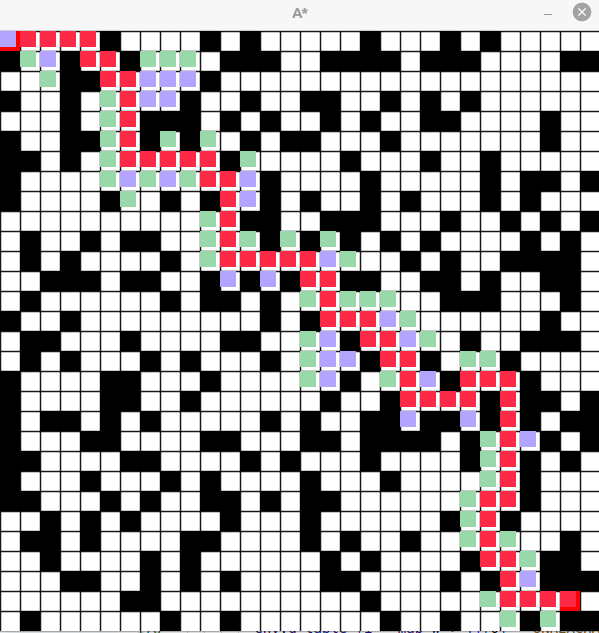

# AstarVisualization
使用opencv展示A*算法整个搜索过程
## 编译运行
```shell
git clone https://github.com/dongtaihong/AstarVisualization.git
cd AstarVisualization 
mkdir build && cd build
cmake .. && make
./astar
```
## 效果

